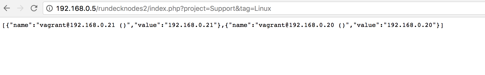

# Rundeck nodes

## Installation

* Install PHP and Apache
  http://vitalflux.com/php-install-apache-2-4-php-5-6-windows/

* Install Composer

  https://getcomposer.org/doc/00-intro.md


* Clone this repo on htdocs folder of Apache

* Install dependencies

    ```composer update```

    or 

    ```php composer.phar update```

## How to use

* Basic Use

    Create a new Option on a rundeck Job, and select "Remote URL".
    Then add the following URL
    http://[APACHE_URL]/rundecknodes/index.php?project=[ProjectName]
    

* Filter by tag

    http://[APACHE_URL]/rundecknodes/index.php?project=[ProjectName]&tag=someTag
    *using tag=All will desible the filter.

    in order to using this url related with another option, use:
    http://[APACHE_URL]/rundecknodes/index.php?project=[ProjectName]&tag=${option.tag.value}




